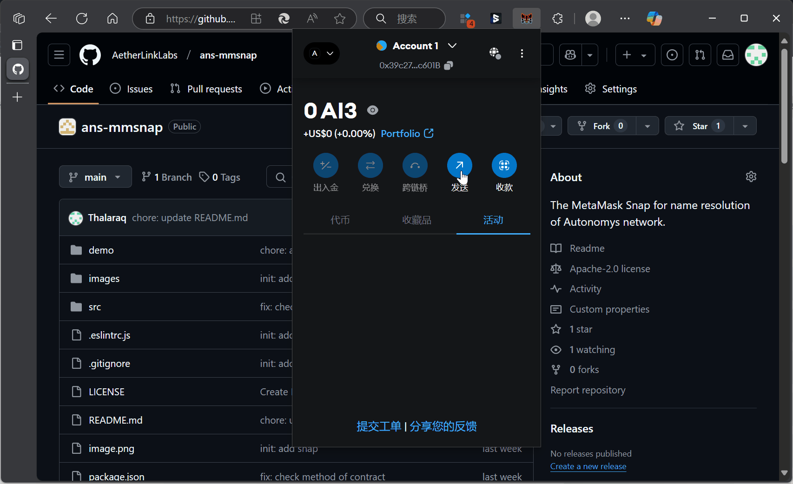

# Metamask Snap For Name Resolution in Autonomys

## Overview

This MetaMask Snap provides name resolution services for Autonomys Name Service (ANS). It enables users to resolve domain names to Ethereum addresses directly within MetaMask.
By the way, every user in the Autonomys network can call the `ANS Contract`(0xbdF673bd60232917Ce960AD268a8bF6441CeFDdD) to register  their own ans domain name

## Features

- Resolves domain names to Ethereum addresses
- Integrates seamlessly with MetaMask
- Directly interacts with ANS smart contracts through MetaMask for maximum security (no additional network calls)
- Supports reverse resolution (coming soon)

## Demonstration



## Installation

The snap is currently on submitting to MetaMask, after submitting, you can install the snap from the [MetaMask Snap Market](https://snaps.metamask.io/snap/npm/ans-mmsnap/) directly.

## Development

Before you start, you need some preparation, refer to [Quickstart](https://docs.metamask.io/snaps/get-started/quickstart/) 
To set up the development environment:

```bash
yarn install
```
yarn start
```

To build the snap:

```bash
yarn build
```

## Testing

Run the test suite:

```bash
yarn test
```

## License

This project is licensed under (MIT-0 OR Apache-2.0) - see the LICENSE file for details.
